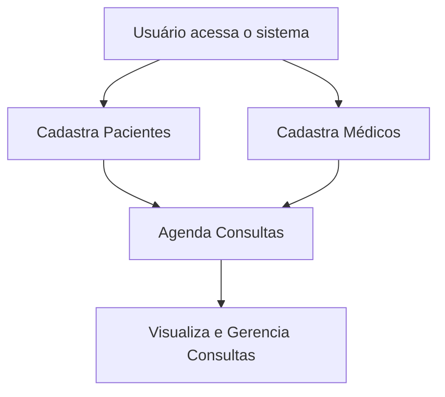
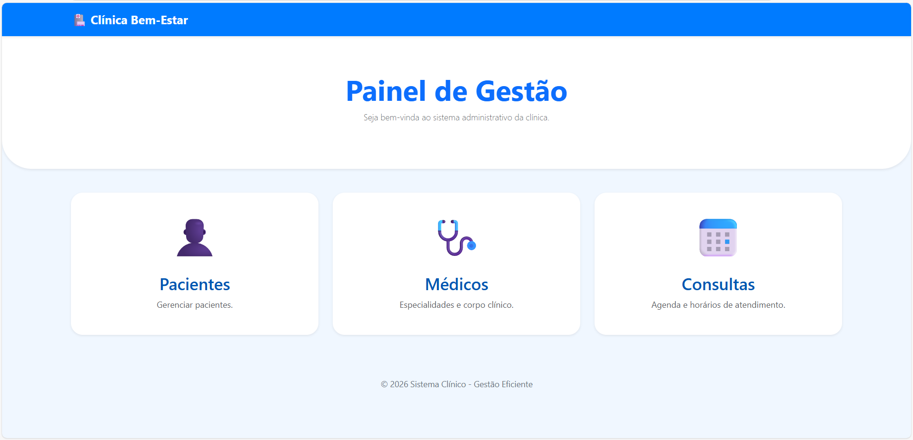
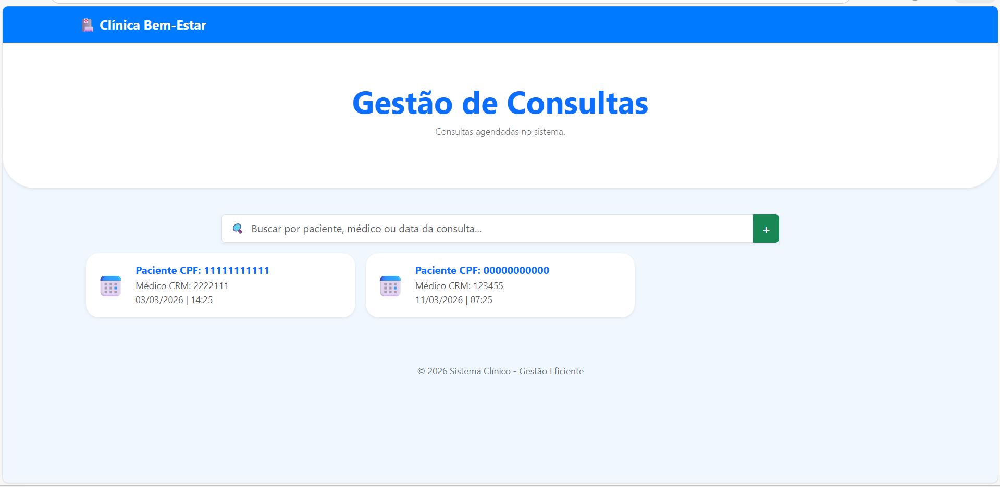
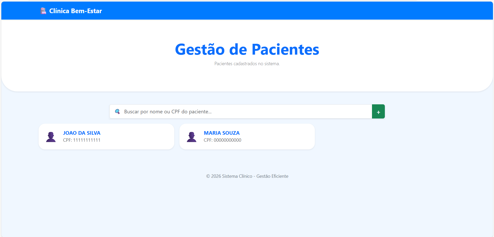
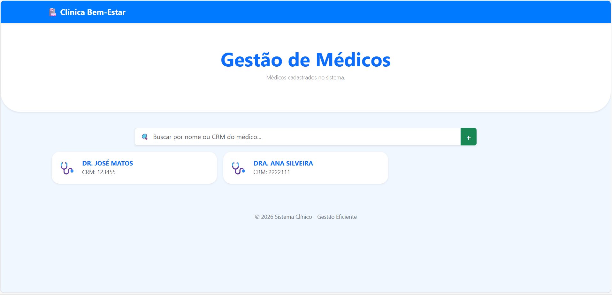
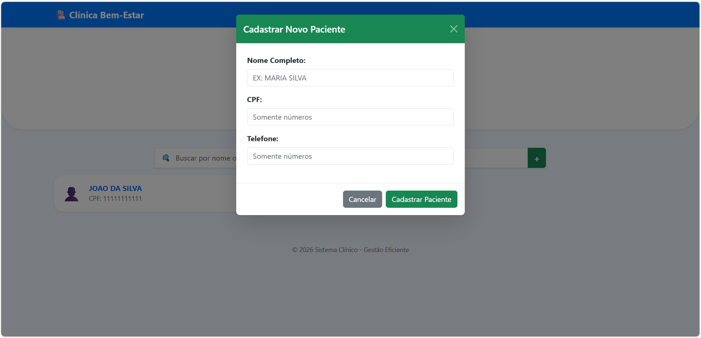
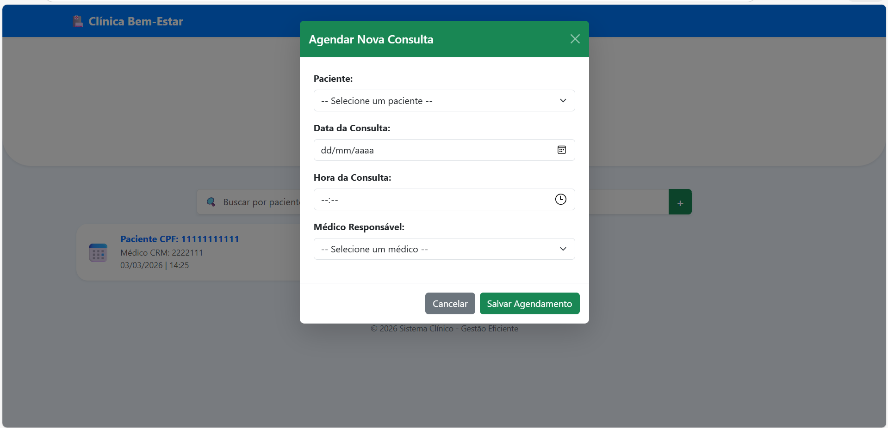
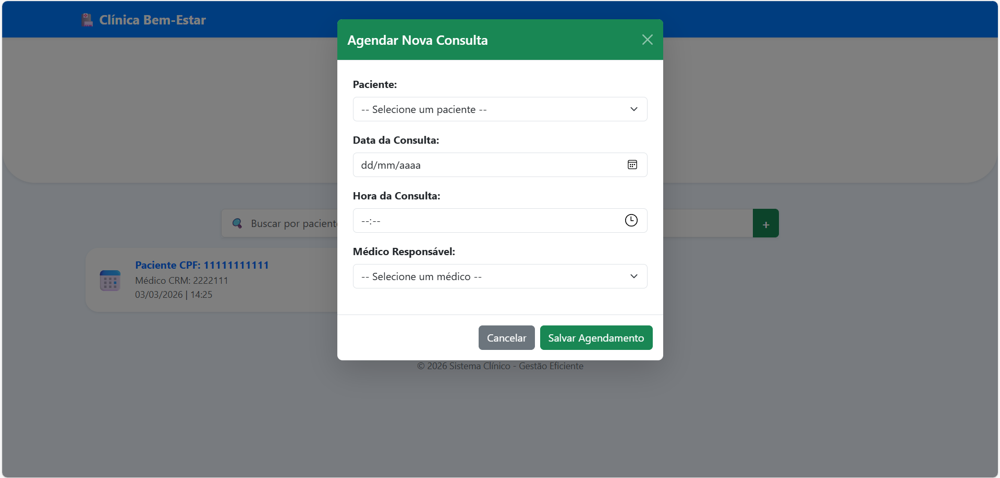

# 🏥 Sistema de Consultas Médicas

Um projeto pessoal para gerenciar pacientes, médicos e consultas de forma simples e eficiente.

## 📋 Funcionalidades

### 👥 Gestão de Pacientes
- ✅ Cadastrar novos pacientes com CPF, nome e telefone
- ✅ Visualizar lista de todos os pacientes
- ✅ Atualizar informações de pacientes
- ✅ Deletar pacientes do sistema

### 👨‍⚕️ Gestão de Médicos
- ✅ Cadastrar novos médicos com CRM, nome e especialidade
- ✅ Visualizar lista de todos os médicos
- ✅ Atualizar informações de médicos
- ✅ Deletar médicos do sistema

### 📅 Gestão de Consultas
- ✅ Agendar novas consultas selecionando paciente e médico disponíveis
- ✅ Visualizar todas as consultas em cards com informações claras
- ✅ Validação para não agendar consultas no passado
- ✅ Validação para não agendar paciente/médico com conflito de horário
- ✅ Buscar consultas por CPF, CRM ou data (suporta formatos DD/MM/YYYY e YYYY-MM-DD)
- ✅ Editar consultas existentes
- ✅ Deletar consultas

## � Fluxograma do Sistema



## �🚀 Tecnologias Utilizadas

### Backend
- **Python 3.x** - Linguagem principal
- **Flask** - Framework web
- **SQLite** - Banco de dados
- **Flask-CORS** - Suporte a requisições cross-origin

### Frontend
- **HTML5** - Estrutura
- **CSS3** - Estilização
- **Bootstrap 5** - Framework CSS
- **JavaScript (Vanilla)** - Interatividade

## 📁 Estrutura do Projeto

```
consultasProjeto/
├── main.py                 # Arquivo principal para iniciar a aplicação
├── app.py                  # Configuração do Flask
├── routes.py               # Rotas da API
├── database.py             # Configuração e inicialização do banco de dados
├── requirements.txt        # Dependências do projeto
├── banco.db                # Banco de dados SQLite
├── static/                 # Arquivos estáticos
│   ├── css/
│   │   └── style.css       # Estilos personalizados
│   └── js/
│       ├── consulta.js     # Lógica de consultas
│       ├── home.js         # Lógica da página inicial
│       ├── medico.js       # Lógica de médicos
│       └── pacientes.js    # Lógica de pacientes
└── templates/              # Templates HTML
    ├── index.html          # Página inicial
    ├── paciente.html       # Página de pacientes
    ├── medico.html         # Página de médicos
    └── consulta.html       # Página de consultas
```

## 🔧 Instalação e Configuração

### Pré-requisitos
- Python 3.7 ou superior
- pip (gerenciador de pacotes Python)

### Passos de Instalação

1. **Clone ou acesse o diretório do projeto:**
```bash
cd consultasProjeto
```

2. **Crie um ambiente virtual (opcional mas recomendado):**
```bash
python -m venv .venv
.venv\Scripts\Activate  # Windows
source .venv/bin/activate  # Linux/Mac
```

3. **Instale as dependências:**
```bash
pip install -r requirements.txt
```

4. **Execute a aplicação:**
```bash
python main.py
```

5. **Acesse no navegador:**
```
http://localhost:5000
```

## 📦 Dependências

- Flask==2.3.0
- Flask-CORS==4.0.0

Ver `requirements.txt` para versões específicas.

## 🎯 Como Usar

### Cadastrando um Paciente
1. Clique em "👥 Pacientes" no menu
2. Preencha o formulário com CPF, nome e telefone
3. Clique em "Cadastrar Paciente"

### Cadastrando um Médico
1. Clique em "👨‍⚕️ Médicos" no menu
2. Preencha o formulário com CRM, nome e especialidade
3. Clique em "Cadastrar Médico"

### Agendando uma Consulta
1. Clique em "📅 Consultas" no menu
2. Clique no botão "+" para abrir o modal de agendamento
3. Selecione o paciente na lista dropdown
4. Selecione a data e hora da consulta
5. Selecione o médico na lista dropdown
6. Clique em "Salvar Agendamento"

### Buscando Consultas
1. Na página de consultas, use o campo de busca para filtrar por:
   - **CPF do paciente** (ex: 123.456.789-00)
   - **CRM do médico** (ex: 12345)
   - **Data** (ex: 31/01/2026 ou 2026-02-15)

## ✨ Validações Implementadas

- ✅ Paciente e médico devem existir antes de agendar consulta
- ✅ Não é possível agendar consulta no passado
- ✅ Não é possível agendar paciente/médico com conflito de horário (mesmo médico no mesmo horário ou paciente com duas consultas no mesmo horário)
- ✅ CPF e CRM devem ser únicos
- ✅ Todos os campos obrigatórios são validados

## 🔒 Segurança

- Validação de dados em frontend e backend
- Prevenção de SQL Injection com prepared statements
- Verificação de existência de recursos antes de operações
- Tratamento de erros com mensagens amigáveis

## 🐛 Tratamento de Erros

Todos os erros retornam mensagens claras e user-friendly:
- "Paciente não encontrado no sistema!"
- "Médico não encontrado no sistema!"
- "Este médico já possui uma consulta agendada neste horário!"
- "Este paciente já possui uma consulta agendada neste horário!"
- "Não é possível marcar uma consulta no passado!"

## 📱 Interface Responsiva

O sistema é totalmente responsivo e funciona bem em:
- 💻 Desktop
- 📱 Tablets
- 📲 Smartphones

## 🎨 Design

A interface utiliza um design moderno e intuitivo com:
- Cores profissionais (azul e verde)
- Cards para melhor organização visual
- Modals para formulários
- Ícones para melhor compreensão
- Bootstrap 5 para responsividade

## 📸 imagens


*Tela inicial do sistema com menu de navegação para pacientes, médicos e consultas.*


*Lista de consultas agendadas em formato de cards, com opções de busca e edição.*


*Gerenciamento de pacientes: cadastro, edição e exclusão.*


*Gerenciamento de médicos: cadastro, edição e exclusão.*

#### Cadastros 


*Formulário para cadastrar novo paciente com CPF, nome e telefone.*


*Formulário para cadastrar novo médico com CRM, nome e especialidade.*


*Modal para agendar consulta selecionando paciente, médico, data e hora.*

## 📝 Notas Importantes

- O banco de dados é criado automaticamente na primeira execução
- As consultas marcadas para o passado não podem ser agendadas
- A data mínima para agendar é sempre hoje (data atual)
- Os dropdowns de paciente e médico carregam automaticamente os dados do banco

## 📝 Notas Pessoais

Este é um projeto pessoal que desenvolvi para praticar Python e Flask. Não é para uso comercial, apenas para aprendizado.

---

**Última atualização:** 20 de fevereiro de 2026
